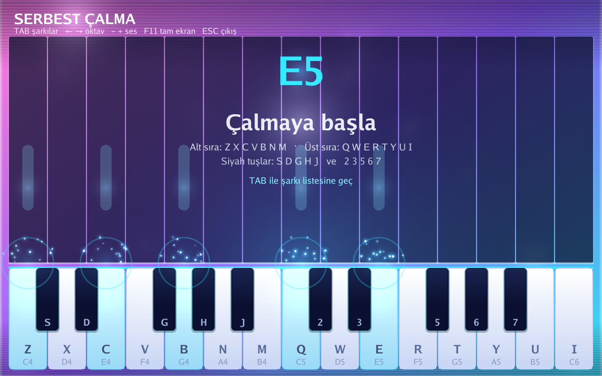
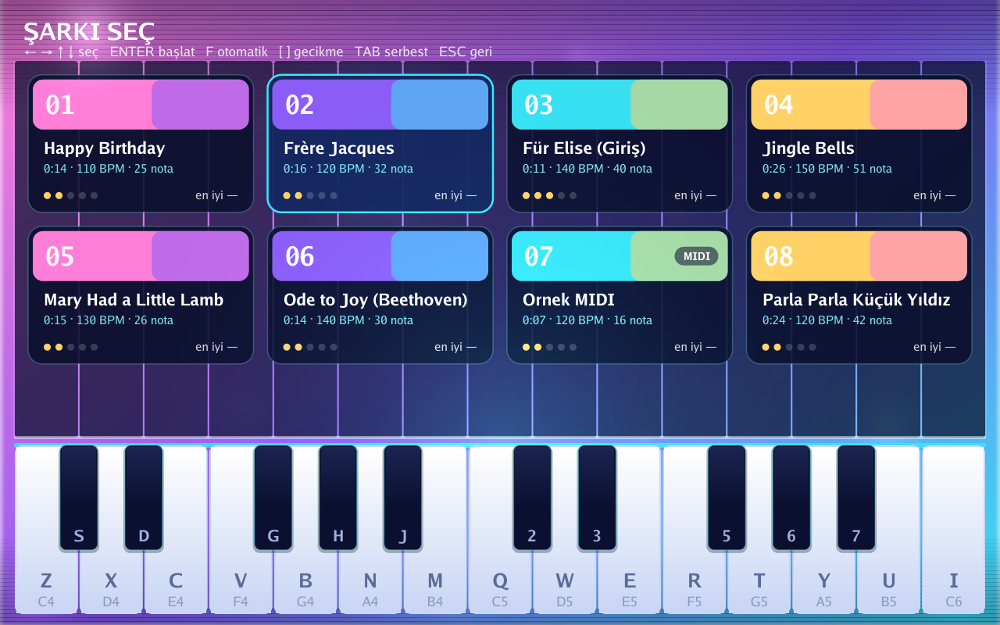
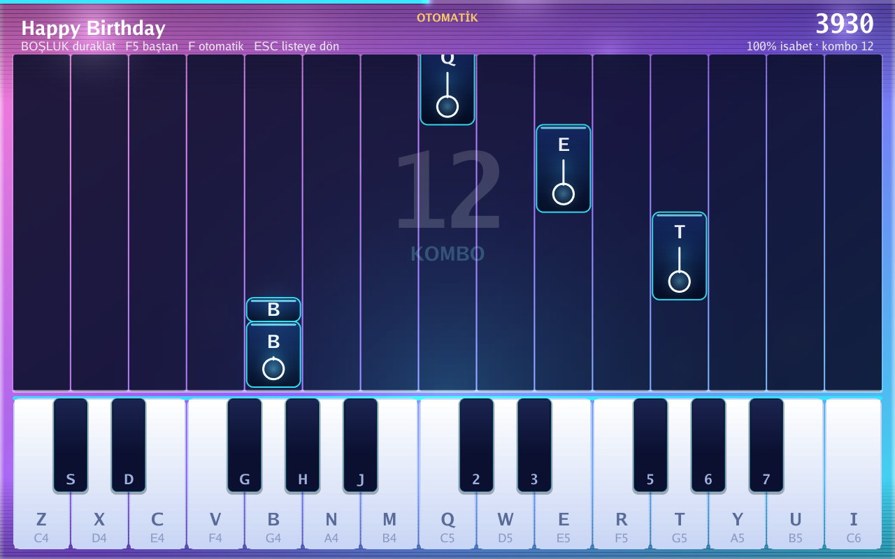
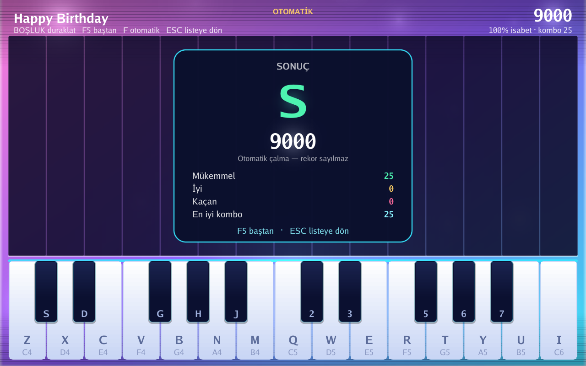

# 🎹 Neon Piyano

Go ile yazılmış, grafik arayüzlü bir piyano. Bilgisayar klavyesiyle canlı
çalabilir ya da şarkı modunda yukarıdan düşen notalara zamanında basarak puan
toplayabilirsin. Ses tamamen kod içinde sentezlenir — hazır ses dosyası yoktur.



## Çalıştırma

```bash
go run .
# ya da derleyip:
go build -o piano.exe .
./piano.exe
```

## Modlar

**TAB** ile serbest çalma ve şarkı listesi arasında geçiş yapılır.

### Serbest çalma
Klavyeden istediğini çal. Basılan tuş neon parlar, isabet hattından yukarı
doğru bir ışık şeridi süzülür; son çalınan notanın adı (ör. `E5`) ekranın
ortasında görünür.

### Şarkı modu
`songs/` klasöründeki şarkılar kart ızgarası olarak gelir. Her kartta kapak,
başlık, süre, tempo, nota sayısı, zorluk (5 noktadan) ve en iyi skor görünür.
**← → ↑ ↓** (ya da fare) ile seç, **ENTER** (ya da seçili karta tekrar tıkla)
ile başlat. Pencere genişledikçe sütun sayısı artar.



Notalar yukarıdan düşer, her notanın üzerinde basılacak bilgisayar tuşu yazar; doğru tuşa doğru anda basarsan
*Mükemmel*, biraz kayarsan *İyi*, kaçırırsan kombo sıfırlanır. Şarkı bitince
puan, isabet oranı ve harf notu (S–D) gösterilir.

Klavye parçanın aralığına göre daralır: bir oktava sığan bir şarkıda 8 beyaz
tuş gösterilir ve şeritler genişler, daha geniş parçalarda iki oktava çıkar.

Pencerenin üstündeki ince çubuk şarkının ilerleyişini gösterir.



Parçayı önce dinlemek istersen **F** ile otomatik çalmayı aç; oyun kendi kendine
kusursuz çalar. Otomatik çalmayla alınan skor rekor sayılmaz.

Şarkı bitince puan, isabet oranı ve harf notu gösterilir. En iyi skorlar
kullanıcı yapılandırma klasörüne (`ULAK/save.json`) kaydedilir, yani
oyunu kapatsan da kaybolmaz.



## Tuşlar

### Piyano (en fazla iki oktav + tepe do)
| Tuşlar | Notalar |
|--------|---------|
| `Z X C V B N M` | Pes oktav beyaz tuşlar |
| `S D` · `G H J` | Pes oktav siyah tuşlar |
| `Q W E R T Y U I` | Tiz oktav beyaz tuşlar |
| `2 3` · `5 6 7` | Tiz oktav siyah tuşlar |

Bu, yaygın "sanal piyano" düzenidir: siyah tuşlar gerçek piyanodaki gibi bir
üst sıraya denk gelir.

### Kontroller
| Tuş | İşlev |
|-----|-------|
| `Tab` | Serbest çalma ↔ şarkı listesi |
| `←` / `→` | Oktavı indir / yükselt (yalnız serbest modda); listede kart seç |
| `[` / `]` | Giriş gecikmesi telafisi −/+ 10 ms |
| `-` / `+` | Sesi kıs / aç |
| `F11` | Tam ekran |
| `↑` / `↓` | Kart seç (liste ekranında) |
| `Enter` | Seçili şarkıyı başlat |
| `Boşluk` | Duraklat / devam et |
| `F5` | Şarkıyı baştan başlat |
| `F` | Otomatik çalma (kendi kendine kusursuz çalar) |
| `Esc` | Geri dön — serbest moddayken çıkış |

## Kendi şarkını ekleme

### MIDI (.mid) — sürükle bırak
Bir `.mid` / `.midi` dosyasını oyun penceresine **sürükleyip bırak**; dosya
`songs/` klasörüne kopyalanır ve listede kart olarak görünür (kartta `MIDI`
rozeti olur). Ritim dosyanın kendi zamanlamasından okunur: tempo değişimleri
dahil her nota gerçek zamanında düşer. Birden çok kanal varsa melodi olma
ihtimali en yüksek kanal seçilir, akorlarda en tiz nota alınır, davul kanalı
atlanır. SMPTE zamanlı dosyalar desteklenmez.

Notalar doğru ama elin hep biraz erken/geç basıyorsa **`[`** ve **`]`** ile
giriş gecikmesini 10 ms'lik adımlarla ayarla; ayar kaydedilir.

### Metin (.txt)

`songs/` klasörüne bir `.txt` dosyası koy:

```
# title: Şarkının Adı
# tempo: 120
C4 C4 G4 G4 A4 A4 G4:2
F4 F4 E4 E4 D4 D4 C4:2
```

- `#` ile başlayan satırlar üstbilgidir (`title`, `tempo`) veya yorumdur.
- Her nota `AD` veya `AD:SÜRE` biçimindedir. Süre **vuruş** cinsindendir
  (varsayılan `1`). `tempo` dakikadaki vuruş sayısıdır.
- Nota adları: `C4`, `F#5`, `Bb3`, `A4` … (`#` diyez, `b` bemol, sondaki rakam oktav).
- `-` bir es (sessizlik) demektir, ör. `-:2`.
- Klavye şarkının aralığına oturur; buna rağmen dışarıda kalan notalar oktav
  kaydırılarak içeri alınır, yani her şarkı çalınabilir kalır.

## README görsellerini yeniden üretme

Ekran görüntüleri gerçek arayüzden alınır; arayüz değişince şunu çalıştırman yeter:

```bash
go run . -docs docs
```

Uygulama serbest çalma, şarkı listesi, şarkı ve sonuç ekranlarını sırayla
gezip `docs/` klasörüne PNG olarak yazar ve kapanır (ses kapalıdır).

## Yapı

```
main.go                 giriş noktası, pencereyi açar
internal/theory/        nota adı -> MIDI -> frekans dönüşümü
internal/audio/         hoparlör + piyano tonu sentezi (gopxl/beep)
internal/song/          şarkı dosyası ayrıştırma (metin ve MIDI)
internal/game/          grafik arayüz (Ebitengine)
  theme.go              palet, gradyanlar, parlama ve yazı yardımcıları
  keyboard.go           piyano klavyesi: düzen, tuş eşlemesi, çizim
  highway.go            düşen notalar, isabet değerlendirme, skor
  particles.go          kıvılcım, halka ve arka plan efektleri
  game.go               durum makinesi ve ekranlar
  cards.go              şarkı kartı ızgarası ve seçimi
  scores.go             en iyi skor ve gecikme ayarının diske kaydı
  shots.go              README ekran görüntüsü üretici (-docs)
songs/                  örnek şarkılar (Beethoven, Für Elise, Jingle Bells ...)
docs/                   README görselleri
```

## Bağımlılıklar
- [Ebitengine](https://ebitengine.org) — pencere, çizim ve girdi
- [gopxl/beep](https://github.com/gopxl/beep) — ses sentezi
- [Go fonts](https://go.dev/blog/go-fonts) — arayüz yazı tipi
